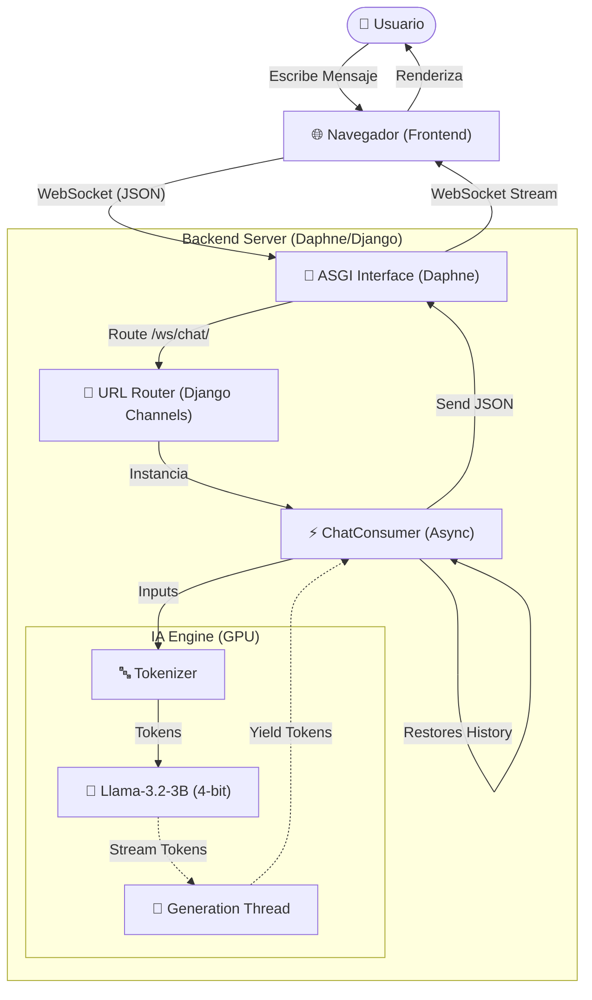

# 🏗️ Arquitectura del Sistema FicaAsistant

Este documento describe la arquitectura técnica del chatbot **FicaAsistant**, detallando cómo interactúan Django, los WebSockets y el modelo de IA Llama-3.2-v3 para ofrecer respuestas en tiempo real.

---

## 🧩 Diagrama de Arquitectura

El siguiente diagrama ilustra el flujo de datos desde que el usuario envía un mensaje hasta que recibe la respuesta generada por la IA.

---

## 🛠️ Componentes Principales

### 1. Frontend (La Cara)
*   **Tecnología**: HTML5, CSS3, JavaScript (Vanilla).
*   **Responsabilidad**:
    *   Gestionar la interfaz de chat (burbujas de mensaje, modo oscuro).
    *   Mantener la conexión persistente vía **WebSockets** (`ws://...`).
    *   Renderizar los tokens en tiempo real a medida que llegan ("efecto máquina de escribir").
    *   Gestionar el historial de chat para reconexiones.

### 2. Servidor Web & WebSockets (El Sistema Nervioso)
*   **Tecnología**: **Django 5.0** + **Django Channels** + **Daphne**.
*   **Por qué WebSockets?**: A diferencia de HTTP tradicional (donde se pide una página completa), los WebSockets permiten una conexión bidireccional permanente. Esto es crucial para el **streaming** de texto, permitiendo que la IA envíe palabra por palabra sin recargar la página.
*   **Daphne**: Es el servidor ASGI que maneja tanto peticiones HTTP (vistas normales) como conexiones WebSocket asíncronas.

### 3. Motor de Inteligencia Artificial (El Cerebro)
*   **Modelo Base**: `unsloth/Llama-3.2-3B-Instruct`.
*   **Fine-Tuning**: Adaptadores LoRA entrenados específicamente con normativa universitaria.
*   **Eficiencia**:
    *   **Cuantización 4-bit (`bitsandbytes`)**: Reduce el uso de memoria VRAM para que el modelo corra en una GPU de consumo (8GB).
    *   **PEFT (Parameter-Efficient Fine-Tuning)**: En lugar de cargar todo el modelo re-entrenado, cargamos el modelo base + capas ligeras (adaptadores), lo que es más rápido y eficiente.

---

## 🔄 Flujo Completo de una Interacción

1.  **Conexión y Restauración**: 
    Al abrir la página, el navegador inicia un handshake WebSocket con `/ws/chat/`. 
    *   Si es la primera vez, se inicializa el historial con la *Instrucción del Sistema*.
    *   Si el usuario recarga la página, el navegador envía automáticamente el historial previo (`restore_history: true`) para mantener el contexto de la conversación.

2.  **Recepción del Mensaje**:
    El usuario envía `{"message": "¿Cuándo son las matrículas?"}`. El consumidor recibe el JSON y lo agrega al historial de la conversación.

3.  **Procesamiento (Tokenización)**:
    El mensaje text es convertido a números (tokens) entendibles por el modelo usando el `AutoTokenizer`.

4.  **Generación Asíncrona (Streaming)**:
    *   Aquí ocurre la magia. Django no espera a que la IA termine de pensar toda la frase.
    *   Se lanza un **Hilo (Thread)** separado para la generación.
    *   Se usa `TextIteratorStreamer` para capturar cada nuevo token generado en tiempo real.

5.  **Envío de Respuesta**:
    *   El `ChatConsumer` lee los tokens del streamer uno por uno.
    *   Envía cada fragmento vía WebSocket: `{"type": "stream", "content": "Las"}` ... `{"type": "stream", "content": " matrículas"}` ...
    *   El navegador concatena estos fragmentos instantáneamente en la pantalla.

6.  **Finalización**:
    Cuando el modelo detecta que terminó la respuesta, envía un token especial de fin (`EOS`). El consumidor cierra el stream y espera la siguiente pregunta.

---

## 📂 Estructura de Archivos Clave

| Archivo | Función |
|---------|---------|
| `chatbot/asgi.py` | Punto de entrada del servidor. Decide si una petición es HTTP o WebSocket. |
| `chatbot_app/routing.py` | "Mapa" que dice qué código maneja la URL `/ws/chat/`. |
| `chatbot_app/consumers.py` | **El núcleo**. Carga el modelo IA, maneja la lógica del chat y el streaming. |
| `chatbot_app/templates/chat.html` | El cliente web. Contiene el JavaScript que conecta al WebSocket. |

---

## 🚀 Tecnologías Utilizadas

*   **Python**: Lenguaje principal.
*   **Django**: Framework web.
*   **Channels**: Extensión de Django para WebSockets.
*   **PyTorch**: Framework de Deep Learning.
*   **Transformers (Hugging Face)**: Librería para cargar y usar Llama-3.
*   **Unsloth**: Librería de optimización que permitió entrenar el modelo 2x más rápido.
