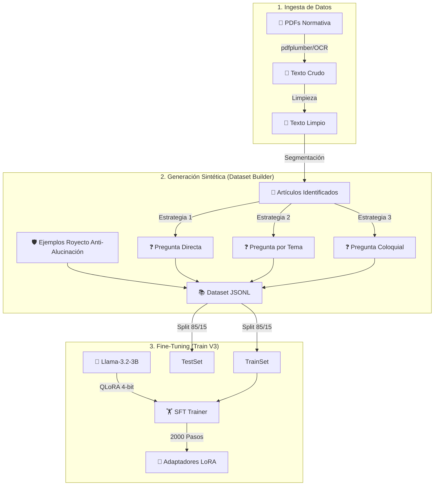

# 🎓 Flujo de Entrenamiento del Modelo FicaAsistant

Este documento detalla el proceso técnico completo para crear el modelo de IA: desde la ingesta de PDFs crudos hasta el Fine-Tuning final utilizando técnicas avanzadas de optimización.

---

## 🔄 Pipeline de Entrenamiento

---

## 🛠️ Fase 1: Ingeniería de Datos (`Dataset Builder V3`)

El mayor desafío fue convertir documentos PDF estáticos en conocimientos conversacionales. No usamos un LLM externo para generar preguntas, sino un **motor de reglas determinista** diseñado en Python.

### 1.1 Extracción y Limpieza
*   **Lectura Híbrida**: Usamos `pdfplumber` para PDFs digitales y `pytesseract` (OCR) como respaldo si el documento era escaneado.
*   **Limpieza de Ruido**: Se eliminaron encabezados repetitivos ("UNIVERSIDAD TÉCNICA DEL NORTE", "RECTORADO") y pies de página para no "ensuciar" el contexto.
*   **Segmentación**: Usamos Expresiones Regulares (`Regex`) para detectar automáticamente el inicio de cada artículo (`ARTÍCULO \d+`, `DISPOSICIÓN...`).

### 1.2 Sintetización de Preguntas (Strategies)
Por cada artículo extraído, el script genera automáticamente 3 variantes de entrenamiento para enseñar al modelo a generalizar:

| Estrategia | Ejemplo Generado | Objetivo |
|------------|------------------|----------|
| **1. Directa** | "¿Qué dice el Artículo 45?" | Memorización exacta de la referencia. |
| **2. Temática** | "¿Qué establece la normativa sobre las matrículas extraordinarias?" | Asociación de conceptos clave. |
| **3. Coloquial** | "Explícame cómo funcionan las matrículas" | Comprensión de lenguaje natural. |

### 1.3 Mecanismo Anti-Alucinación
Para evitar que el bot responda cosas que no sabe (como preguntas de fútbol, medicina, o ubicación de edificios que no están en los PDFs), inyectamos **ejemplos negativos** manuales.
*   **Input**: "¿Quién ganó el mundial?"
*   **Target**: "No tengo esa información en la normativa universitaria."

Esto "enseña" al modelo a rechazar amablemente preguntas fuera de su dominio.

---

## ⚙️ Fase 2: Fine-Tuning con QLoRA

Entrenar un modelo de 3 billones de parámetros desde cero es costoso. Usamos **QLoRA (Quantized Low-Rank Adaptation)** para hacerlo eficiente en una sola GPU.

### Configuración del Entrenamiento (`train_peft_v3.py`)

*   **Modelo Base**: `unsloth/Llama-3.2-3B-Instruct`.
*   **Librería**: `Unsloth` (optimiza el entrenamiento para ser 2x más rápido y usar 70% menos memoria).
*   **Hiperparámetros Clave**:
    *   **Max Steps**: `2000` (Garantiza convergencia profunda).
    *   **Learning Rate**: `1e-4` (Estabilidad).
    *   **Batch Size**: `1` (Con acumulación de gradiente = 2).
    *   **LoRA Rank (r)**: `32` (Capacidad media-alta para aprender nuevos conceptos).
    *   **LoRA Alpha**: `64` (Factor de escala).

### ¿Por qué Llama-3.2?
Es un modelo "Small Language Model" (SLM) optimizado para dispositivos de borde. Sus 3B de parámetros son suficientes para dominar un dominio cerrado (normativa) sin requerir servidores masivos.

---

## 📊 Fase 3: Evaluación y División

El dataset generado se dividió automáticamente en:
*   **Train (85%)**: Para enseñar al modelo.
*   **Test (15%)**: Para evaluar rendimiento (Loss y Perplexity) durante el entrenamiento y evitar Overfitting.

### Métricas Observadas
Durante los 2000 pasos, monitoreamos la **Pérdida de Evaluación (Eval Loss)**. Una curva descendente constante indicó que el modelo estaba aprendiendo correctamente la sintaxis y el contenido de la normativa, en lugar de solo memorizar.

---

## 📂 Archivos Relacionados

| Archivo | Descripción |
|---------|-------------|
| `dataset_builder_v3.py` | Script principal de extracción y generación de datos. |
| `train_peft_v3.py` | Script de entrenamiento con configuración de hiperparámetros. |
| `requirements_unsloth.txt` | Dependencias específicas para el entorno de entrenamiento. |
