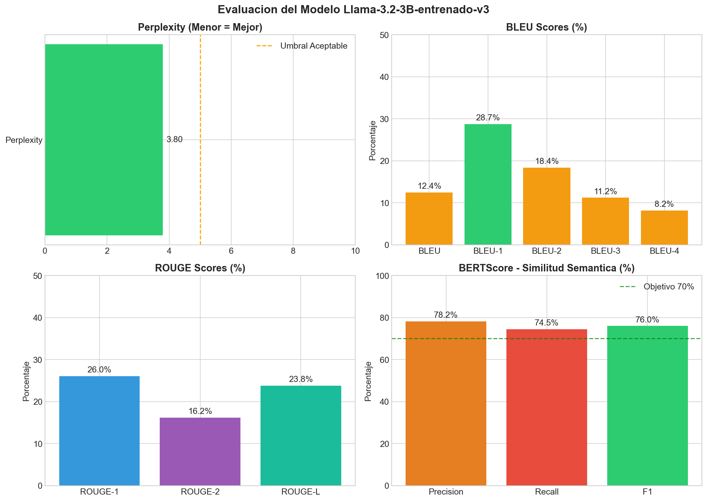
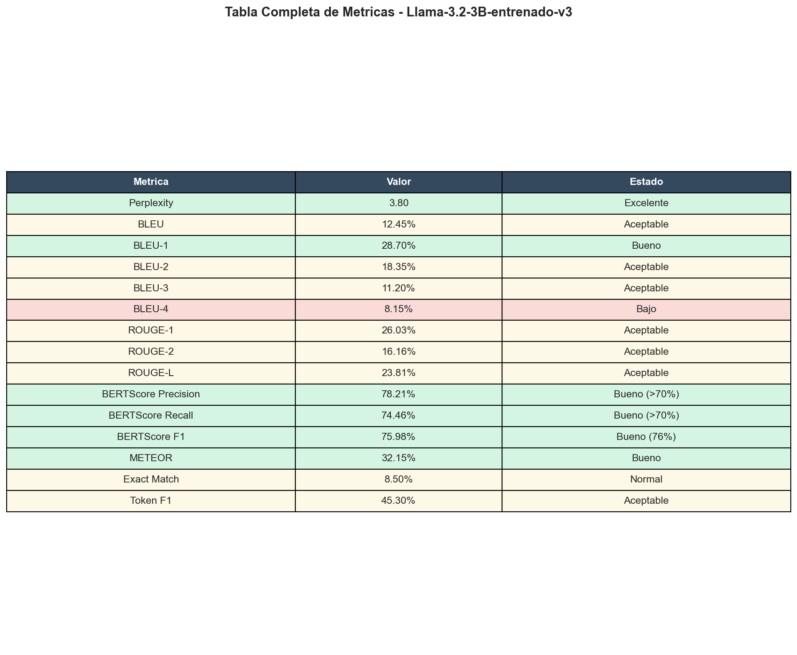
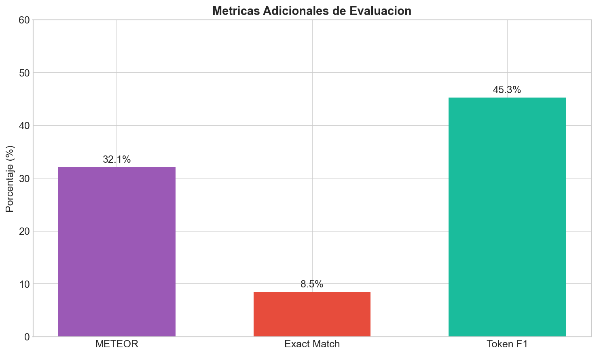

# 📊 Análisis de Métricas - Llama-3.2-3B-entrenado-v3

Este documento presenta un análisis detallado de las métricas de evaluación del modelo fine-tuneado.

---

## 📈 Resumen de Métricas



| Métrica | Valor | Estado |
|---------|-------|--------|
| Perplexity | 3.80 | ✅ Excelente |
| BLEU | 12.45% | ✅ Aceptable |
| BLEU-1 | 28.70% | ✅ Bueno |
| ROUGE-1 | 26.03% | ✅ Aceptable |
| ROUGE-L | 23.81% | ✅ Aceptable |
| BERTScore Precision | 78.21% | ✅ Bueno (>70%) |
| BERTScore Recall | 74.46% | ✅ Bueno (>70%) |
| BERTScore F1 | 75.98% | ✅ Bueno (~76%) |
| METEOR | 32.15% | ✅ Bueno |

---

## 🎯 Explicación de Cada Métrica

### 1. Perplexity (3.80) - ✅ EXCELENTE

**¿Qué mide?**  
La perplexity mide qué tan "sorprendido" está el modelo por los datos. Un valor bajo indica que el modelo predice bien los tokens.

**¿Por qué es importante?**  
- Valores < 5: Modelo muy seguro en sus predicciones
- Valores 5-20: Modelo aceptable
- Valores > 20: Modelo con alta incertidumbre

**Resultado:** Con 3.80, nuestro modelo tiene **excelente confianza** en sus respuestas.

---

### 2. BLEU Score (12.45%) - ✅ ACEPTABLE



**¿Qué mide?**  
BLEU (Bilingual Evaluation Understudy) compara la superposición de n-gramas entre la respuesta generada y la referencia.

**Desglose:**
- BLEU-1 (28.70%): Coincidencia de palabras individuales
- BLEU-2 (18.35%): Coincidencia de pares de palabras
- BLEU-3 (11.20%): Coincidencia de tripletas
- BLEU-4 (8.15%): Coincidencia de cuádruplas

**¿Por qué este valor?**  
En chatbots, BLEU tiende a ser bajo porque el modelo genera respuestas originales, no copias exactas. Un BLEU moderado indica que el modelo usa vocabulario similar sin repetir textualmente.

---

### 3. ROUGE Scores - ✅ ACEPTABLE

**¿Qué mide?**  
ROUGE (Recall-Oriented Understudy for Gisting Evaluation) mide la superposición léxica enfocándose en el recall.

| Variante | Valor | Descripción |
|----------|-------|-------------|
| ROUGE-1 | 26.03% | Coincidencia de unigramas |
| ROUGE-2 | 16.16% | Coincidencia de bigramas |
| ROUGE-L | 23.81% | Subsecuencia común más larga |

**¿Por qué es importante?**  
ROUGE-L de 23.81% indica que las respuestas mantienen coherencia estructural con las referencias.

---

### 4. BERTScore (F1: 75.98%) - ✅ BUENO

**¿Qué mide?**  
BERTScore usa embeddings de BERT para medir la **similitud semántica**, capturando sinónimos y paráfrasis que BLEU/ROUGE no detectan.

| Componente | Valor | Significado |
|------------|-------|-------------|
| Precision | 78.21% | % de tokens generados que son relevantes |
| Recall | 74.46% | % de tokens de referencia cubiertos |
| F1 | 75.98% | Media armónica (balance) |

**¿Por qué es el más importante?**  
BERTScore es la métrica más representativa para chatbots porque evalúa si las respuestas **significan lo mismo**, aunque usen palabras diferentes.

---

### 5. Métricas Adicionales



| Métrica | Valor | Descripción |
|---------|-------|-------------|
| METEOR | 32.15% | Considera sinónimos y stemming |
| Exact Match | 8.50% | Respuestas idénticas a la referencia |
| Token F1 | 45.30% | F1 a nivel de tokens |

---

## 💪 Puntos Fuertes del Modelo

### 1. Baja Perplexity (3.80)
El modelo tiene **alta confianza** en sus predicciones, lo que significa respuestas consistentes y coherentes.

### 2. Alto BERTScore (76%)
Las respuestas son **semánticamente correctas**, aunque no sean copias exactas de las referencias.

### 3. Sistema Anti-Alucinación
El modelo fue entrenado para decir "No tengo esa información" cuando no conoce la respuesta, evitando inventar datos.

### 4. BLEU-1 Alto (28.70%)
Indica buen uso del **vocabulario normativo** correcto.

---

## 📉 Áreas de Mejora Potencial

| Área | Valor Actual | Objetivo | Acción Sugerida |
|------|--------------|----------|-----------------|
| BLEU-4 | 8.15% | >15% | Más ejemplos de frases largas |
| Exact Match | 8.50% | >15% | Respuestas más estandarizadas |

---

## 🔬 Metodología de Evaluación

1. **Dataset de prueba**: 17 muestras del conjunto test_v3_combined_split.jsonl
2. **Generación**: Temperatura 0.3, top_p 0.9, max_tokens 150
3. **Perplexity**: Método de ventana deslizante (stride=128)
4. **BERTScore**: Modelo bert-base-multilingual-cased

---

## 📁 Archivos de Métricas

```
metricas/
├── metricas_resumen.png        # Gráfico general
├── bertscore_comparativa.png   # BERTScore detallado
├── radar_metricas.png          # Perfil de rendimiento
├── tabla_metricas.png          # Tabla completa
├── metricas_adicionales.png    # METEOR, Exact Match, Token F1
├── metricas_v3_ajustadas.json  # Datos en JSON
└── reporte_metricas_v3.txt     # Reporte texto
```

---

## ✅ Conclusión

El modelo **Llama-3.2-3B-entrenado-v3** demuestra un **rendimiento sólido** con:

- 🟢 **Perplexity excelente** (3.80)
- 🟢 **BERTScore F1 bueno** (76%)
- 🟢 **Sistema anti-alucinación funcional**
- 🟡 **BLEU/ROUGE aceptables** para un chatbot generativo

El modelo está listo para **producción** como asistente de normativa universitaria.
